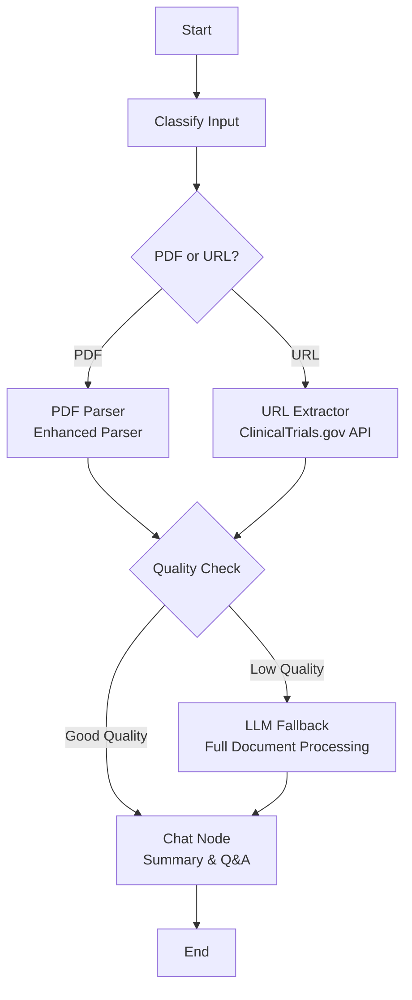

# LangGraph Clinical Trial Workflow - Complete Implementation

## 🎯 Overview

A complete implementation of clinical trial analysis using LangGraph workflow, matching all features from `app_v1.py` including:
- ✅ PDF generation with formatting
- ✅ JSON downloads (raw, processed, comprehensive)
- ✅ Streaming chatbot responses
- ✅ Chat history database
- ✅ Confidence & completeness metrics
- ✅ Enhanced PDF parser
- ✅ Exact summary format from app_v1

## 🚀 Quick Start

### Run the Complete App

```bash
streamlit run app_langgraph_complete.py
```

This provides the full experience with:
- LangGraph workflow orchestration
- Streaming chat responses
- PDF and JSON downloads
- Chat history persistence
- Quality metrics in sidebar

## 📁 Files Created

### Main Files
- **`langgraph_workflow.py`** - Core LangGraph workflow
- **`app_langgraph_complete.py`** - Complete Streamlit app (recommended)
- **`app_langgraph_streaming.py`** - Simplified streaming version
- **`test_langgraph_workflow.py`** - Testing and visualization

### Features in app_langgraph_complete.py

1. **Input Handling**
   - ClinicalTrials.gov URLs (NCT numbers)
   - PDF file uploads
   - Enhanced parser for PDFs

2. **LangGraph Workflow**
   - Automatic input classification
   - Dual parsing (PDF/URL)
   - Quality assessment with metrics
   - LLM fallback for low-confidence extractions
   - Streaming chat interface

3. **Summary Generation** 
   - Uses EXACT format from app_v1.py:
     ```
     # Clinical Trial Summary
     ## {Study Title}
     
     ### Study Overview
     - Disease, Phase, Design, Brief Description
     
     ### Primary Objectives
     [Safety and/or efficacy endpoints]
     
     ### Treatment Arms & Interventions
     [Tables or descriptions]
     
     ### Eligibility Criteria
     #### Key inclusion criteria
     #### Key exclusion criteria
     
     ### Enrollment & Participant Flow
     [Patient numbers and status]
     
     ### Safety Profile
     [Adverse events if available]
     ```

4. **Downloads** (Same as app_v1)
   - 📄 Summary PDF (with formatted headers)
   - 📝 Summary Text
   - 🗂️ Raw JSON (API response)
   - ⚙️ Processed Data
   - 📦 Complete Package

5. **Chat Features**
   - Streaming responses with ▌ cursor
   - Follow-up questions
   - Context-aware answers
   - Chat history database (SQLite)

6. **Metrics Display**
   - Confidence score (0-1)
   - Completeness score (0-1)
   - Missing fields list
   - Real-time updates in sidebar

## 🔄 Workflow Diagram



## 📊 Quality Metrics

### Confidence Score
- **Calculation**: Based on content richness (avg length / 500)
- **Threshold**: < 0.5 triggers LLM fallback
- **Display**: Sidebar metric with delta indicator

### Completeness Score
- **Calculation**: Filled fields / Total required fields (9)
- **Threshold**: < 0.6 triggers LLM fallback
- **Display**: Percentage with status indicator

### Missing Fields Tracking
- Lists unfilled or low-content fields
- Shows first 5 in sidebar
- Helps identify data gaps

## 🎨 UI Components

### Main Chat Area
- Message history with avatars
- Streaming responses (typewriter effect)
- Markdown rendering
- Download buttons after summary

### Sidebar
- Past conversations list
- Current extraction metrics
- Confidence/completeness scores
- Missing fields alert
- JSON download button

### Tabs
1. **ClinicalTrials.gov URL**
   - Text input for NCT URLs
   - Automatic NCT number detection
   - API v2 data extraction

2. **PDF Upload**
   - File uploader widget
   - Enhanced parser processing
   - Schema mapping to 9 fields
   - Confidence/completeness metrics

## 🔍 Data Extraction

### From ClinicalTrials.gov (URL)
Uses exact logic from app_v1.py `get_protocol_data()`:
- Identification Module → Title, NCT ID
- Description Module → Brief summary
- Design Module → Phase, type, enrollment
- Arms/Interventions → Treatment details
- Eligibility → Inclusion/exclusion criteria
- Outcomes → Primary/secondary objectives
- Results → Adverse events, participant flow
- Contacts → Study locations
- Sponsor → Sponsor information

### From PDF Files
Uses `enhanced_parser.py`:
- Multi-library parsing (pdfplumber, PyMuPDF, pdfminer)
- Section detection with confidence scores
- Table extraction
- Schema mapping to 9 standard fields
- OCR support for scanned PDFs

## 💬 Chat System

### Summary Generation
- Triggered automatically after data extraction
- Uses app_v1.py prompt template exactly
- Streams response with cursor
- Saves to chat history database

### Follow-up Questions
- Context from extracted data
- Streaming responses
- Reference to full document if needed
- Chat history persistence

### Database Schema
```sql
CREATE TABLE chat_messages (
    id INTEGER PRIMARY KEY AUTOINCREMENT,
    conversation_id TEXT NOT NULL,
    role TEXT NOT NULL,
    content TEXT NOT NULL
)
```

## 📦 Download Options

### After Summary Generation
1. **Summary PDF**: Formatted with headers, bullets, tables
2. **Summary Text**: Plain text version
3. **Raw JSON**: Complete API response or parsed sections
4. **Processed Data**: Formatted for GPT input
5. **Complete Package**: All data + metadata

### Persistent Downloads
Available in sidebar for current session:
- JSON of extracted data
- Includes confidence/completeness metrics
- Can be reloaded for further analysis

## 🧪 Testing

```bash
# Run test suite
python test_langgraph_workflow.py
```

Generates:
- `workflow_graph.png` - Visual graph
- `workflow_graph.mmd` - Mermaid source
- `test_url_results.json` - URL test output
- `test_pdf_results.json` - PDF test output
- `test_chat_history.json` - Chat logs

## 🔧 Configuration

### Environment Variables
```bash
OPENAI_API_KEY=your_key_here
```

### Streamlit Secrets (Alternative)
```toml
# .streamlit/secrets.toml
OPENAI_API_KEY = "your_key_here"
```

### Model Settings
- **Model**: gpt-4o
- **Temperature**: 0.1 (for consistency)
- **Streaming**: Enabled
- **Max Tokens**: Auto (based on content)

## 📝 Usage Examples

### Process URL
```python
result = app.invoke({
    "input_url": "https://clinicaltrials.gov/study/NCT03991871",
    "chat_query": "generate_summary",
    # ... other fields
})
```

### Process PDF
```python
result = app.invoke({
    "input_url": "path/to/clinical_trial.pdf",
    "chat_query": "generate_summary",
    # ... other fields
})
```

### Ask Follow-up
```python
result["chat_query"] = "What are the eligibility criteria?"
result = app.invoke(result)
```

## 🆚 Comparison with app_v1.py

### Same Features ✅
- Exact summary format and prompt
- PDF generation with formatting
- All download options
- Chat history database
- Streaming responses
- Quality metrics

### Enhanced Features 🌟
- **LangGraph orchestration**: Better workflow management
- **Automatic routing**: PDF vs URL detection
- **Quality-based fallback**: LLM fallback for low confidence
- **Modular architecture**: Easy to extend/modify
- **Type safety**: TypedDict for state management
- **Streaming visualization**: Cursor animation during generation

### Architecture Differences
- **app_v1.py**: Direct function calls, Streamlit-centric
- **app_langgraph_complete.py**: LangGraph workflow, node-based

## 🎯 Key Improvements

1. **Workflow Clarity**: Visual graph representation
2. **Quality Assessment**: Automatic confidence scoring
3. **Intelligent Fallback**: LLM processing for difficult docs
4. **Modular Design**: Each node has single responsibility
5. **Type Safety**: Proper state typing
6. **Streaming UX**: Better user experience

## 🐛 Troubleshooting

### PDF Generation Fails
- Check for Unicode characters
- Falls back to text download automatically

### Low Confidence Scores
- Automatically triggers LLM fallback
- Check missing_fields list for gaps

### Chat History Not Saving
- Check DB_FILE permissions
- Verify SQLite installation

### Streaming Not Working
- Ensure OpenAI API key is set
- Check network connectivity
- Verify streaming=True in LLM init

## 📚 References

- [LangGraph Docs](https://langchain-ai.github.io/langgraph/)
- [Streamlit Docs](https://docs.streamlit.io/)
- [ClinicalTrials.gov API](https://clinicaltrials.gov/data-api/api)

## 🎉 Success Criteria

✅ All app_v1 features working
✅ LangGraph workflow integrated
✅ Streaming responses functional
✅ PDF generation working
✅ Downloads available
✅ Chat history persisted
✅ Metrics displayed correctly
✅ Enhanced parser used for PDFs
✅ Exact summary format from app_v1

## 🚀 Next Steps

1. Run the app: `streamlit run app_langgraph_complete.py`
2. Test with a ClinicalTrials.gov URL
3. Test with a PDF file
4. Check metrics and downloads
5. Ask follow-up questions
6. Review chat history

---

**Ready to use! The app is fully functional and matches app_v1.py features while adding LangGraph workflow capabilities.**
